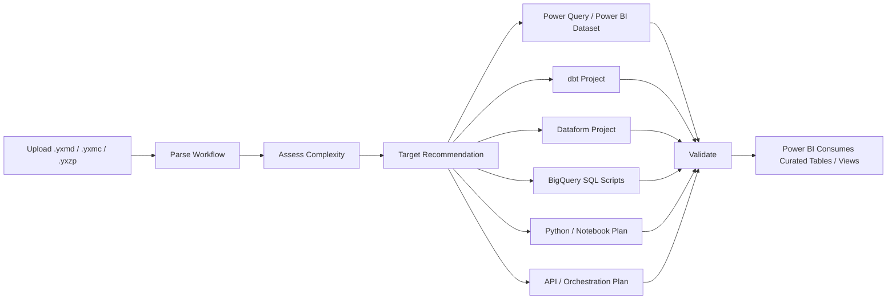
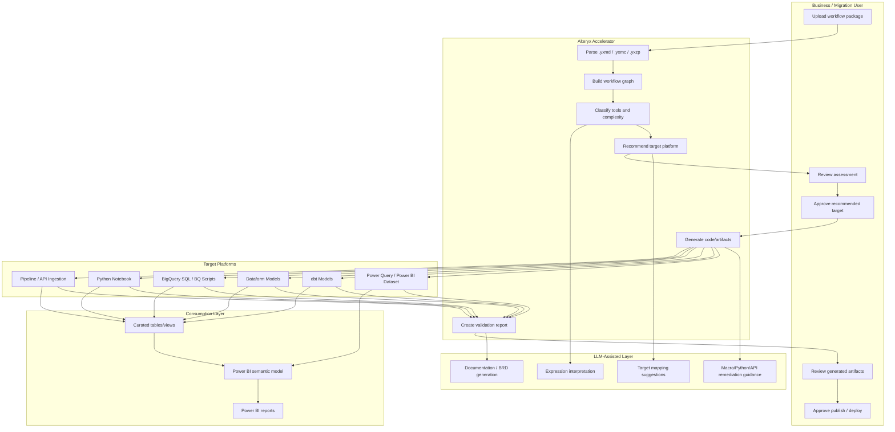

# Target-Aware Alteryx Accelerator Wireframe

## Management Summary

The Accelerator should evolve from a single-path converter:

```text
Alteryx workflow -> Power Query -> Power BI dataset
```

to a target-aware migration accelerator:

```text
Alteryx workflow -> assessment -> target recommendation -> generated artifacts -> validation -> BI consumption
```

This lets simple and mid-level workflows continue to publish directly to Power BI, while complex or warehouse-centric workflows can be converted to dbt, Dataform, BigQuery SQL, Python notebooks, or orchestration components.

## Proposed User Flow



## Swimlane View



## UI Wireframe

### Screen 1: Upload And Discovery

```text
┌────────────────────────────────────────────────────────────────────────────┐
│ Target-Aware Alteryx Accelerator                                           │
│ Upload | Assess | Target | Generate | Validate | Deploy                    │
├────────────────────────────────────────────────────────────────────────────┤
│ Upload Workflow Package                                                    │
│                                                                            │
│ [Drop .yxmd / .yxmc / .yxzp / .zip]                                        │
│                                                                            │
│ Parsed Package                                                             │
│ ┌──────────────────────────────┬─────────────────────────────────────────┐ │
│ │ Workflow                     │ WF04_HERO_Complex_751Tools.yxmd          │ │
│ │ Total Tools                  │ 751                                      │ │
│ │ Connections                  │ 750                                      │ │
│ │ Macros                       │ Standard, batch, iterative               │ │
│ │ Python/Jupyter               │ Detected                                 │ │
│ │ REST API / Bearer Token      │ Detected                                 │ │
│ └──────────────────────────────┴─────────────────────────────────────────┘ │
│                                                                            │
│                                           [Continue To Assessment]          │
└────────────────────────────────────────────────────────────────────────────┘
```

### Screen 2: Complexity And Tool Assessment

```text
┌────────────────────────────────────────────────────────────────────────────┐
│ Workflow Assessment                                                        │
├────────────────────────────────────────────────────────────────────────────┤
│ ┌─────────────┐ ┌─────────────┐ ┌─────────────┐ ┌───────────────────────┐ │
│ │ Total Tools │ │ Complexity  │ │ Auto Fit    │ │ Recommended Strategy   │ │
│ │ 751         │ │ High        │ │ Partial     │ │ Target-aware migration │ │
│ └─────────────┘ └─────────────┘ └─────────────┘ └───────────────────────┘ │
│                                                                            │
│ Capability Split                                                           │
│ Current code / minimum changes       620 tools                             │
│ Complex code changes required         96 tools                             │
│ Next phase / flow redesign            35 tools                             │
│                                                                            │
│ Tool Breakdown                                                             │
│ ┌────────────────────────────┬───────┬──────────────┬───────────────────┐ │
│ │ Tool Family                │ Count │ Status       │ Suggested Target   │ │
│ ├────────────────────────────┼───────┼──────────────┼───────────────────┤ │
│ │ Filter / Select / Formula  │ 400   │ Supported    │ PQ / SQL / dbt     │ │
│ │ Join / Union / Summarize   │ 220   │ Partial      │ SQL / dbt/Dataform │ │
│ │ REST API Download          │ 12    │ Complex      │ Ingestion pipeline │ │
│ │ Python / Jupyter           │ 8     │ Next phase   │ Python notebook    │ │
│ │ Batch / Iterative Macro    │ 15    │ Next phase   │ Redesign flow      │ │
│ └────────────────────────────┴───────┴──────────────┴───────────────────┘ │
└────────────────────────────────────────────────────────────────────────────┘
```

### Screen 3: Target Recommendation

```text
┌────────────────────────────────────────────────────────────────────────────┐
│ Target Recommendation                                                      │
├────────────────────────────────────────────────────────────────────────────┤
│ Recommended Target: Dataform / BigQuery SQL                                │
│ Reason: Source and target are BigQuery, transformation logic is SQL-friendly│
│                                                                            │
│ ┌──────────────────────────────┬──────────────┬─────────────────────────┐ │
│ │ Target Option                │ Fit          │ Reason                  │ │
│ ├──────────────────────────────┼──────────────┼─────────────────────────┤ │
│ │ Power Query / Power BI       │ Medium       │ Good for simple outputs │ │
│ │ dbt                          │ High         │ SQL transforms          │ │
│ │ Dataform                     │ High         │ BigQuery-native         │ │
│ │ BigQuery SQL Scripts         │ High         │ Direct BQ deployment    │ │
│ │ Python Notebook              │ Required     │ Python tool detected    │ │
│ │ Pipeline / API Ingestion     │ Required     │ REST bearer token flow  │ │
│ └──────────────────────────────┴──────────────┴─────────────────────────┘ │
│                                                                            │
│ [Accept Recommendation] [Choose Different Target] [Export Assessment]       │
└────────────────────────────────────────────────────────────────────────────┘
```

### Screen 4: Artifact Generation

```text
┌────────────────────────────────────────────────────────────────────────────┐
│ Generate Target Artifacts                                                   │
├────────────────────────────────────────────────────────────────────────────┤
│ Selected Target: Dataform + BigQuery + Python Notebook                      │
│                                                                            │
│ Generated Artifacts                                                         │
│ ┌──────────────────────────────┬─────────────────────────────────────────┐ │
│ │ definitions/stg_orders.sqlx  │ Dataform staging model                   │ │
│ │ definitions/int_sales.sqlx   │ Join / formula / aggregation model       │ │
│ │ definitions/mart_sales.sqlx  │ Final curated table                      │ │
│ │ notebooks/api_ingestion.py   │ REST bearer-token ingestion placeholder  │ │
│ │ notebooks/python_tool.py     │ Python/Jupyter remediation artifact      │ │
│ │ validation/report.html       │ Conversion and reconciliation report     │ │
│ └──────────────────────────────┴─────────────────────────────────────────┘ │
│                                                                            │
│ [Download Project] [Commit To Repo] [Send To Review]                        │
└────────────────────────────────────────────────────────────────────────────┘
```

### Screen 5: Validation And Deployment

```text
┌────────────────────────────────────────────────────────────────────────────┐
│ Validation And Deployment Readiness                                         │
├────────────────────────────────────────────────────────────────────────────┤
│ ┌──────────────────────────────┬──────────────┬─────────────────────────┐ │
│ │ Check                        │ Status       │ Detail                  │ │
│ ├──────────────────────────────┼──────────────┼─────────────────────────┤ │
│ │ Workflow parsed              │ Pass         │ 751 tools detected      │ │
│ │ SQL models generated         │ Pass         │ 14 models               │ │
│ │ REST ingestion configured    │ Warning      │ Credentials required    │ │
│ │ Python tool migrated         │ Warning      │ Notebook review needed  │ │
│ │ Output reconciliation        │ Pending      │ Needs Alteryx output    │ │
│ │ Deployment readiness         │ Blocked      │ 2 remediation items     │ │
│ └──────────────────────────────┴──────────────┴─────────────────────────┘ │
│                                                                            │
│ [Deploy Supported Models] [Return To Remediation] [Export Validation]       │
└────────────────────────────────────────────────────────────────────────────┘
```

## Target Decision Rules

| Workflow Pattern | Recommended Target |
| --- | --- |
| Simple file-to-report workflow | Power Query / Power BI dataset |
| BigQuery source and BigQuery target | Dataform or BigQuery SQL |
| SQL warehouse source and target | dbt |
| Heavy SQL-style joins, filters, aggregations | dbt / Dataform / BigQuery SQL |
| REST API with bearer token | API ingestion pipeline before transformation |
| Python/Jupyter tool | Python notebook or Python model |
| Batch / iterative macro | Redesign as pipeline, recursive SQL, or notebook |
| Exploration / discovery use case | Data Canvas / Power Query / low-code path |
| Production governed data product | dbt / Dataform / BigQuery SQL + validation |

## What Is Required To Achieve This

### 1. Engineering Capabilities

- Python parser enhancements for `.yxmd`, `.yxmc`, `.yxzp`.
- Workflow graph engine to understand branches, joins, outputs, and dependencies.
- Target recommendation engine.
- Power Query generator enhancement.
- New dbt generator.
- New Dataform generator.
- New BigQuery SQL generator.
- Macro analyzer for standard, batch, and iterative macros.
- REST/API ingestion analyzer for bearer-token workflows.
- Python/Jupyter extractor and notebook generator.
- Validation/reconciliation engine.

### 2. LLM Requirements

LLM should be used as an assistant, not the only conversion engine.

Recommended LLM usage:

- Alteryx expression interpretation.
- Complex Formula tool translation.
- Macro behavior summarization.
- REST API remediation recommendations.
- Python/Jupyter code explanation and notebook scaffolding.
- dbt/Dataform model documentation.
- BRD and validation report generation.

Recommended model options:

- GPT frontier model for code generation and structured conversion.
- Claude Sonnet for long-context workflow reasoning and code review.
- DigitalOcean-hosted LLM option if enterprise hosting/cost policies prefer it.
- Smaller model for classification and summarization.

Needed LLM platform features:

- Large context window.
- Function/tool calling or structured JSON output.
- Prompt caching for large workflow XML.
- Enterprise data privacy controls.
- Cost and token usage monitoring.
- Model fallback strategy.

### 3. Data And Platform Requirements

- Representative workflows:
  - simple workflows,
  - 500+ tool workflows,
  - 2,000+ tool workflows,
  - standard/batch/iterative macros,
  - REST bearer-token workflows,
  - Python/Jupyter workflows.
- Sample CSV/database/API inputs.
- Expected Alteryx output files for reconciliation.
- BigQuery sandbox/project.
- dbt environment or repository.
- Dataform workspace.
- Power BI workspace.
- SharePoint or data lake storage for file-based tests.
- Secure secret management for API credentials.

### 4. UI/UX Requirements

- Target recommendation screen.
- Capability split panel.
- Tool-family breakdown.
- Graph view with blockers highlighted.
- Remediation workbench.
- Artifact preview/download.
- Publish/deploy readiness gate.
- Validation dashboard.

### 5. Resource Requirements

- Senior Python/backend developer.
- Python + ML/LLM engineer.
- SQL/dbt/Dataform engineer.
- UI/UX designer.
- React frontend developer.
- Data engineer with BigQuery experience.
- Power BI/Fabric engineer.
- QA/validation engineer.
- Security reviewer for credentials and data handling.

## Suggested Phased Delivery

### Phase 1: Assessment And UI

- Parse and classify workflows.
- Show target recommendation.
- Show tool-family breakdown.
- Add publish/deployment readiness gate.
- Keep current Power Query publishing for simple/mid workflows.

### Phase 2: Multi-Target Code Generation

- Add dbt generator.
- Add Dataform generator.
- Add BigQuery SQL generator.
- Add artifact packaging.
- Add LLM-assisted mapping and review.

### Phase 3: Complex Workflow Remediation

- Macro expansion/redesign.
- REST API ingestion generation.
- Python/Jupyter notebook generation.
- Human-in-the-loop remediation workbench.

### Phase 4: Enterprise Validation And Deployment

- Row-count validation.
- Schema comparison.
- Sample data reconciliation.
- Deployment to dbt/Dataform/BQ/Power BI.
- Audit report and sign-off workflow.

## Recommended Management Positioning

The Accelerator should be positioned as a **target-aware migration accelerator**. Power BI publishing remains supported for simple and mid-level workflows, but complex workflows should be routed to the most appropriate transformation platform: Power Query, dbt, Dataform, BigQuery SQL, Python notebooks, or ingestion pipelines. Power BI then consumes the curated output from those platforms for visualization.
